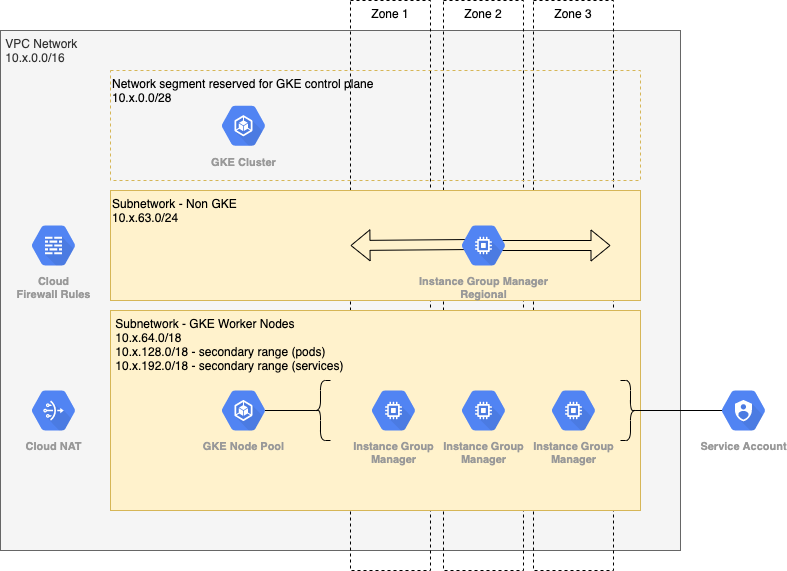

gke-cluster-module
==================

This repository contains a Terraform Module that provisions a Google Kubernetes Engine cluster and any per-cluster supporting resources.

The set of resources defined in this project must be easily destructible and re-creatable.  Resources that have a soft-delete behaviour (e.g., IAM Role) cannot be defined in this module.

## Architecture

The following diagram depicts all of the architectural elements of this module.



### Networking

The module provisions a VPC network with the specified base CIDR address range, which must be a `/16`.  The following diagram shows how that address space is partition.


| CIDR          | Addresses | Usage                                                        |
| ------------- |:---------:| ------------------------------------------------------------ |
| 10.x.0.0/28   | 16        | GKE Cluster Control Plane                                    |
| 10.x.63.0/24  | 256       | Subnetwork used by bastion Instance                          |
| 10.x.64.0/18  | 16,384    | Subnetwork used by Worker Node pool (Instance addresses)     |
| 10.x.128.0/18 | 16,384    | Secondary range used by Worker Node pool (Pod addresses)     |
| 10.x.192.0/18 | 16,384    | Secondary range used by Worker Node pool (Service addresses) |

Two subnetworks are created, one used by the bastion Instances, and the other used by the Worker Node Pool.  The subnetwork used by the bastion Instances is allocated the `10.x.63.0/24` range.  The subnetwork used by the Worker Node Pool is allocated the `10.x.64.0/18` range for its primary range.  This subnetwork is also allocated two additional secondary ranges: `10.x.128.0/18` for Kubernetes Pods and `10.x.192.0/18` for Kubernetes Services.

A Firewall rule is created in the VPC network to allow INGRESS TCP traffic destined for port 22 to any Instance tagged `bastion` from any source.

A NAT gateway is also created to allow outbound connections from the subnetwork used by the Worker Node Pool, since those Instances do not have a public IP address allocated.

### Bastion Instances

The module provisions an Instance Group Manager with an initial target size of `0`.  This Instance Group Manager can be resized to `1` to launch a bastion Instance.  The bastion instance is used as an Internet reachable node where an SSH Tunnel can be established to private IP addresses within the VPC network.

### GKE Cluster

The module provisions a GKE cluster with the following characteristics:

* private nodes
* private endpoint
* **REGULAR** release channel
* control plane access restricted to the subnetwork used by the bastion Instances

## Input Variables

| Variable Name               | Type   | Required | Description |
| --------------------------- | ------ | -------- | ----------- |
| cluster_id                  | string | true     | A unique value used to generate names for resources.  Must start with a letter, followed by 4 to 25 letters, numbers, or hyphens. |
| base_cidr_block             | string | true     | A base CIDR range used in the VPC network created by this network.  The CIDR must be a `/16` size. |
| worker_node_service_account | string | false | An existing service account to set for the worker nodes in the node pool. |

## Output Variables

| Variable Name    | Type   | Description |
| ---------------- | ------ | ----------- |
| k8s_api_endpoint | string | The base URI for the GKE cluster control plane. |
| k8s_cluster_ca   | string | The public certificate of the certificate authority that issued the GKE cluster control plane endpoint's certificate. |

## Requirements

In order to successfully include this module into a Terraform project, version `0.15.0` or greater of **Terraform** is required.  The module also requires version `3.64.0` or greater of the **google** and **google-beta** providers.

## Usage

To include this module in a Terraform project, use the following code:
```
module "gke" {
    source = "git@github.com:marcboudreau/accentis-gke-cluster-module.git?ref=v1.0.0"

    cluster_id      = "production"
    base_cidr_block = "10.0.0.0/16"
}
```
Where the `v1.0.0` term in the source attribute is the specific tag to use.

## Development

This section describes the procedures for improving the module or fixing issues raised.

The **testing/** directory contains a simple Terraform project is used to test the module. The Terraform project takes a single input variable **commit_hash**, the abbreviated git hash for the HEAD commit.  This value is combined with the prefix `test-` to provide a unique name for every unique commit.  A **random_integer** resource is used to provide a random number between 0 and 255 that is then used as the `x` value in the **base_cidr_block** variable (`10.x.0.0/16`).  The **random_integer** will keep returning the same value so long as the **commit_hash** value remains the same.  This ensures that the **base_cidr_block** value remains stable for repeated Terraform apply commands, so long as the **commit_hash** value provided remains the same.

### Local Verification

To verify the module locally, prior to pushing to GitHub, run the following commands:
```
$ cd testing/
$ terraform init
$ terraform apply -var commit_hash=$(git rev-parse --short HEAD)
$ ./verify.sh <commit_hash>
```

Once the initial Terraform **apply** command has been executed, the same **commit_hash** value should continue to be used for all commands that require it.  This will cause Terraform to simply apply the deltas on subsequent Terraform **apply** commands.  If a different **commit_hash** value is used, Terraform will need to recreate every resource since the name of the VPC network will change which forces a replacement (destroy existing resource and create new resource).

Once the verification is complete, destroy the test environment:
```
$ terraform destroy -var commit_hash=<commit_hash>
```

### GitHub Actions

The GitHub actions workflow will repeat the above test automatically for every Pull Request and when the PR is merged to the main branch.
